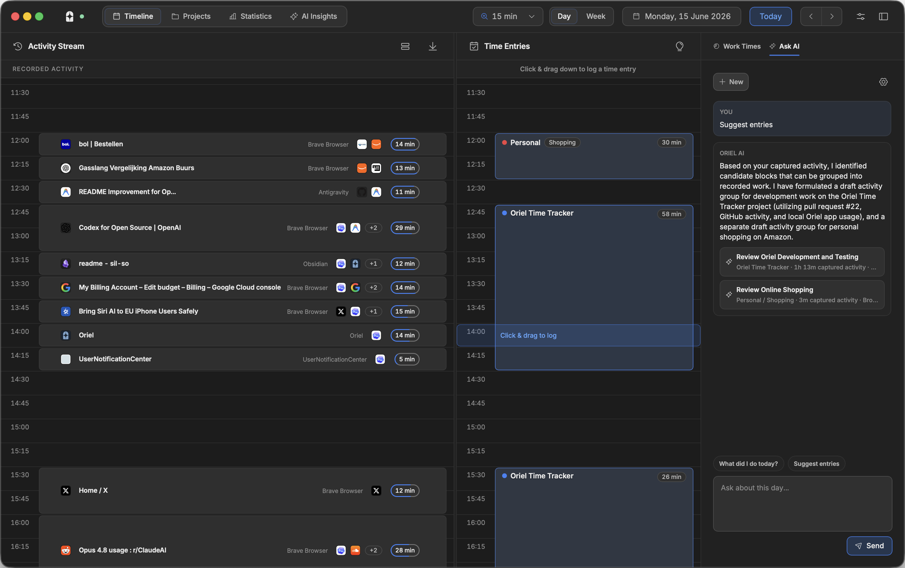
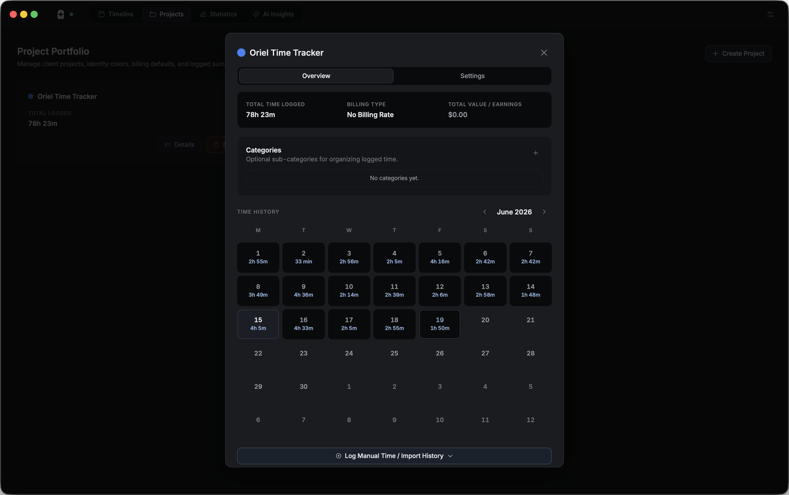
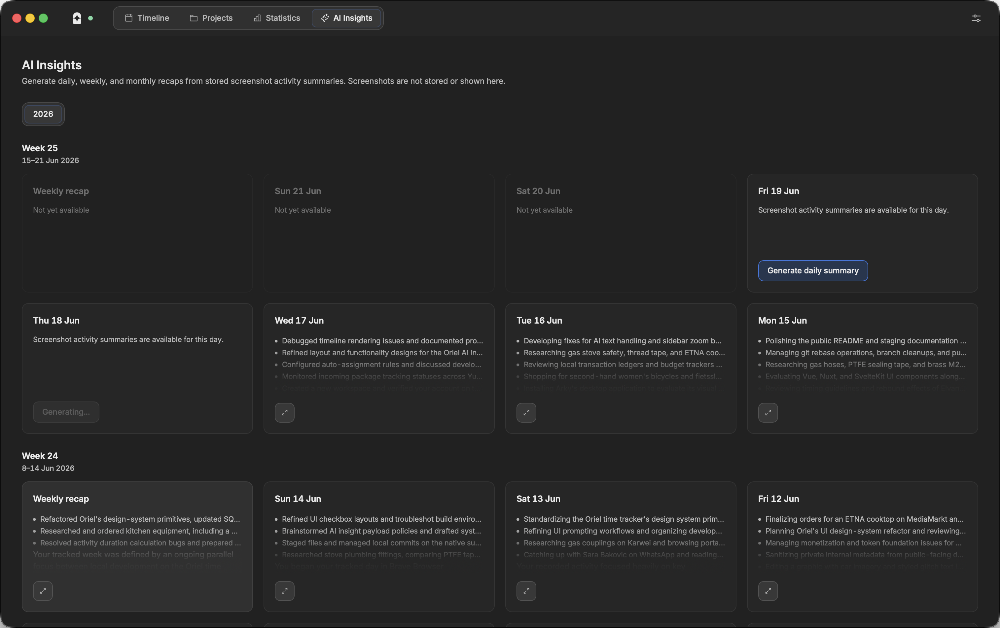
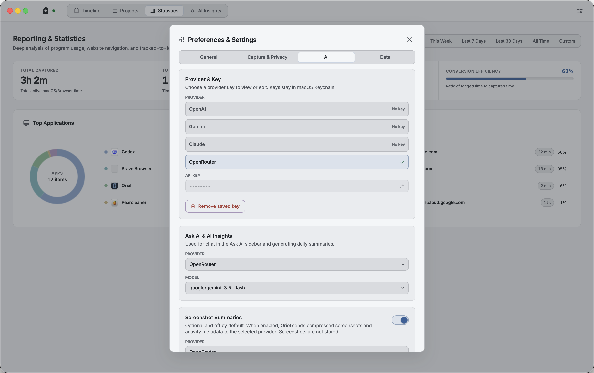
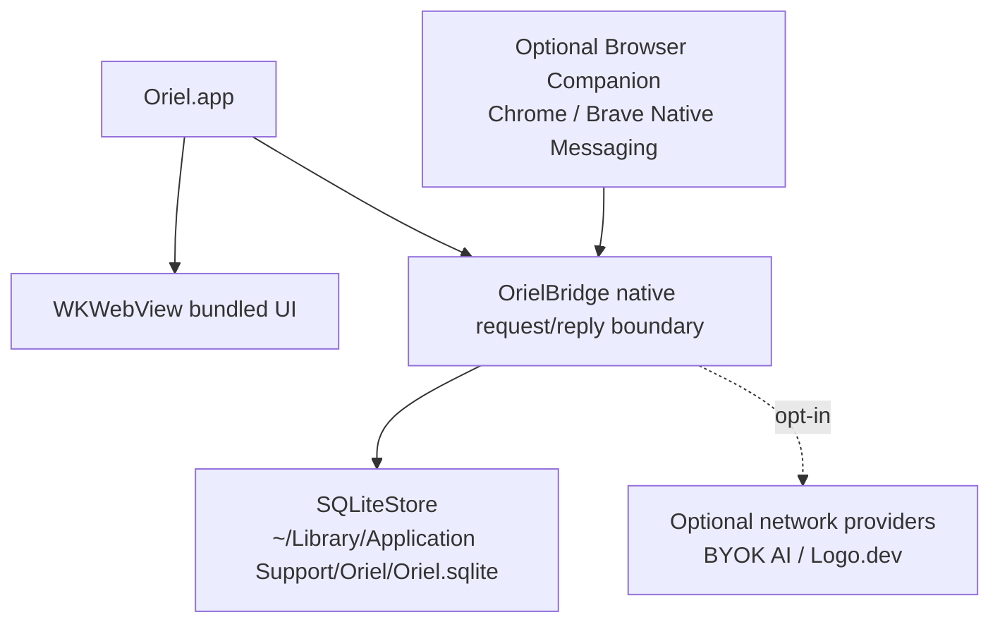

# Oriel

<p align="center">
  
</p>

<p align="center">
  Local-first macOS time tracking for people who need accurate project time
  without sending activity history to a hosted service.
</p>

<p align="center">
  <a href="https://github.com/sil-so/oriel/actions/workflows/ci.yml"></a>
  
  
  <a href="./LICENSE"></a>
</p>


> [!NOTE]
> Oriel is source-build today. Signed and notarized public macOS releases are
> planned, but not available yet.

## Why Oriel

Oriel records local foreground app and browser activity, presents it as a
reviewable timeline, and helps turn that raw history into project, category,
billable, and reporting entries.

- Review captured work in day and week views with the Activity Stream Timeline,
  Time Entries, and Work Times sidebar aligned around the same local timeline.
- See hands-on and hands-off time with Activity Mix, based on recent keyboard,
  mouse, click, and scroll input.
- Convert selected activity into project entries with categories, billable
  defaults, hourly or fixed-rate project settings, and reporting.
- Track project history with project totals, billing summaries, a Time History
  calendar, and manual time/import flows.
- Use assignment rules for app, title, and URL patterns so repeated work can be
  categorized faster.
- Exclude sensitive apps, titles, or URLs from capture, including optional
  cleanup of matching historical activity.
- Use optional BYOK AI workflows for selected-day chat, grouped entry
  suggestions with project context, screenshot summaries, and daily, weekly, or
  monthly insight recaps.

## A Closer Look

### Timeline Review



The Timeline workspace is the main review surface. It keeps captured activity,
logged time, project breakdowns, date navigation, zoom controls, and Ask AI in
one dense desktop workflow.

### Projects And Time History



Projects collect assigned time, billing defaults, categories, project context,
and manual entries. The project detail view includes a Time History calendar so
logged work can be reviewed by day without leaving the project.

### AI Insights



AI Insights can generate daily, weekly, and monthly recaps from stored
screenshot-summary text and local activity statistics. These workflows are
manual and require a user-configured provider key.

### Preferences And Privacy Controls



Preferences make capture state, exclusions, optional browser support, provider
keys, Logo.dev icons, and AI screenshot-summary settings explicit. Networked
features are opt-in.

## Project Status

| Area | Current state |
| --- | --- |
| Supported app path | SwiftPM-built `Oriel.app` |
| Platform | macOS 14+ |
| Storage | Local SQLite at `~/Library/Application Support/Oriel/Oriel.sqlite` |
| Browser support | Optional Chrome/Brave Browser Companion via Native Messaging |
| Hosted service | None |
| CI | GitHub Actions for Node and Swift tests |
| License | MIT |

## Privacy Model

> [!IMPORTANT]
> Oriel is local-first by default. Activity history, projects, time entries,
> settings, and archives stay on the user's Mac unless the user enables an
> optional network feature.

| Feature | Default | What can leave the Mac |
| --- | --- | --- |
| Core activity tracking | On after running the app | Nothing by design |
| Browser Companion | Optional | Browser tab activity sent to the local Oriel app through Native Messaging |
| Logo.dev icons | Off | Website domains, only when enabled |
| Ask AI and entry suggestions | Off until a provider key is configured | Prompt plus selected-day context, including project names, categories, and optional project context, when the user asks |
| AI screenshot summaries | Off | Compressed screenshots and activity metadata when enabled |
| AI daily, weekly, and monthly insights | Manual | Clustered summary text and local timing statistics when generated |
| AI model refresh | Manual | Provider model-list request when requested |

Oriel stores API keys in macOS Keychain. It does not store raw screenshots or
raw AI provider responses. The public source release does not include analytics
or telemetry.

See [PRIVACY.md](./PRIVACY.md) for the detailed data-handling model.

<details>
<summary>Optional network features</summary>

Oriel's networked features are opt-in and provider-specific:

- **Logo.dev icons:** sends website domains to Logo.dev when branded website
  icons are enabled and a publishable key is saved.
- **Ask AI and entry suggestions:** sends the prompt and selected-day context,
  including project names, categories, and optional project context, to the
  configured AI provider when the user submits a question or asks for
  suggestions.
- **AI screenshot summaries:** captures the display containing the active
  app/window, downscales and JPEG-compresses the screenshot in memory, then
  sends it with activity metadata to the selected provider. If the active
  display cannot be resolved, Oriel skips that screenshot summary. Oriel stores
  only validated summary JSON and request metadata needed for local summaries.
- **AI insights:** sends clustered validated screenshot-summary text, sanitized
  activity context, recent summary opening sentences, and local aggregate
  timing statistics to the configured Ask AI provider when the user generates a
  daily, weekly, or monthly recap. Raw screenshots, full URLs, app paths, and
  bundle paths are not sent for recap generation.
- **AI model refresh:** contacts the selected provider only when the user asks
  Oriel to refresh available models.

Review each provider's own privacy and data-use terms before enabling these
features.

</details>

## Requirements

- macOS 14 or newer
- Xcode command line tools / Swift toolchain
- Node.js 18 or newer for frontend asset generation and Node-based tests

Oriel uses Accessibility permissions for detailed app/window capture. Grant
permission to the exact `Oriel.app` build you run.

## Quick Start

```bash
npm install
npm run build:assets
npm test
swift test
./tools/scripts/build_and_run.sh
```

`./tools/scripts/build_and_run.sh` builds `OrielApp` and `OrielBrowserBridge`,
stages a local `build/Oriel.app`, signs it for local execution, stops stale
local app/helper processes, and opens the rebuilt app.

Use `./tools/scripts/build_and_run.sh --verify` to build and stage without
launching.

<details>
<summary>Browser Companion developer setup</summary>

The Browser Companion is currently a developer setup for unpacked Chrome/Brave
extension testing.

1. Open `chrome://extensions` in Chrome or Brave.
2. Enable Developer mode.
3. Load the `extension/` directory as an unpacked extension.
4. Copy the extension identifier.
5. In Oriel Preferences, open Developer Browser Companion and enable the
   identifier.

A Chrome Web Store extension with a finalized identifier is planned.

</details>

## Architecture

Oriel is a native macOS app with a bundled local web interface.



| Path | Responsibility |
| --- | --- |
| `Sources/OrielApp` | App shell, WebKit host, bridge, capture, preferences, Keychain, AI, icons, SQLite persistence |
| `Sources/OrielBrowserBridge` | Native Messaging helper for the optional browser extension |
| `web/index.html`, `web/css/`, `web/js/` | Bundled frontend UI |
| `web/assets/vendor/` | Vendored UI font/icon assets, so normal app use does not rely on CDNs |
| `tools/dev-server/server.js` | Loopback-only development fallback, not a production service boundary |
| `Tests/OrielAppTests/` | Swift tests for native services and persistence |
| `test/` | Node test suite for frontend, bridge, safety, and compatibility behavior |

See [ARCHITECTURE.md](./ARCHITECTURE.md) for more detail.

## Verification

For most changes, run:

```bash
git diff --check
npm test
swift test
```

Run `npm run build:assets` after changing Tailwind input, vendored frontend
assets, or package dependencies.

Run `./tools/scripts/build_and_run.sh` after app changes when you need to verify
the running local app matches the source.

## Maintainer Surface

Oriel records local activity data, so privacy and security review are part of
normal maintenance.

| Area | Current coverage |
| --- | --- |
| Public CI | Node and Swift tests on GitHub Actions |
| Contribution flow | [CONTRIBUTING.md](./CONTRIBUTING.md), issue templates, PR template |
| Privacy model | [PRIVACY.md](./PRIVACY.md), `.gitignore` protections for runtime/private artifacts |
| Security reporting | [SECURITY.md](./SECURITY.md) |
| High-risk code paths | Capture, exclusions, SQLite storage, portable archives, Keychain, Native Messaging, AI, Logo.dev, screenshots, packaging |

Do not include real activity history, full browser URLs, screenshots with
private data, credentials, local SQLite files, logs, archives, signing material,
or private local paths in issues, PRs, tests, fixtures, or documentation.

## Roadmap

- Replace remaining transitional Node fallback paths with native-only flows.
- Publish the Browser Companion through the Chrome Web Store.
- Add signed/notarized macOS distribution.
- Expand public CI and code scanning.

## Contributing

See [CONTRIBUTING.md](./CONTRIBUTING.md) for local setup, verification, and
public contribution expectations.

## Security

Please report vulnerabilities privately. See [SECURITY.md](./SECURITY.md).

## License

Oriel is available under the [MIT License](./LICENSE).
